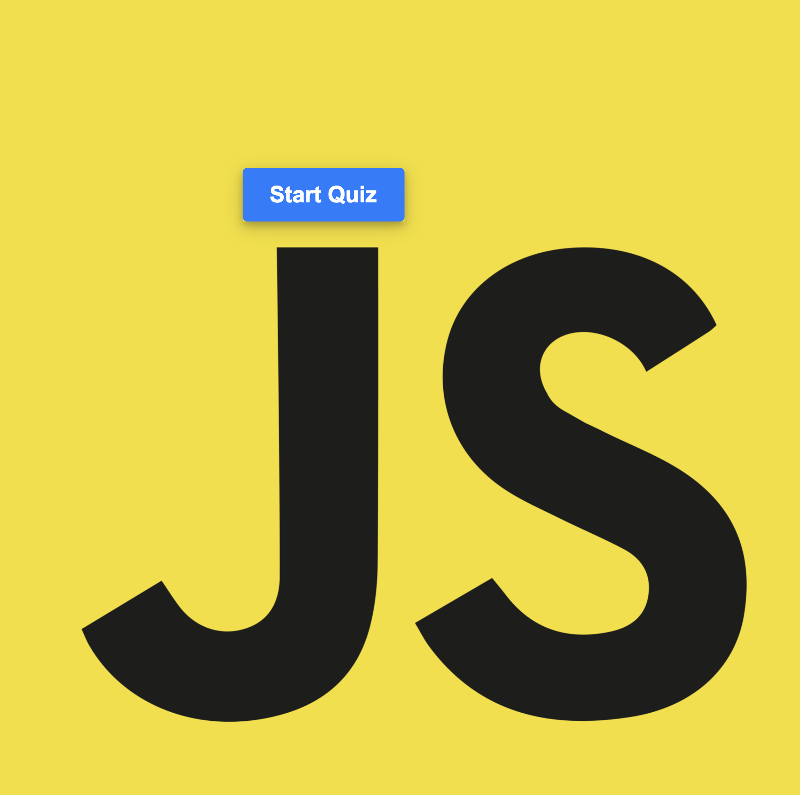
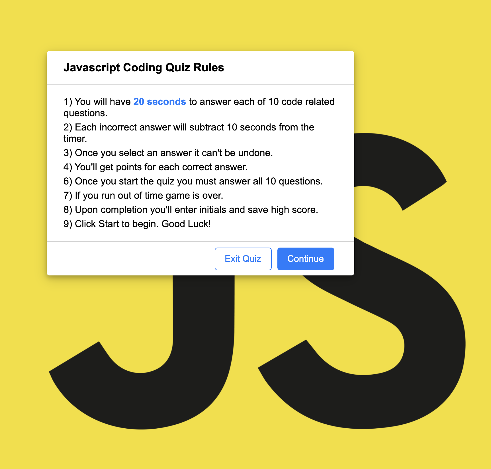
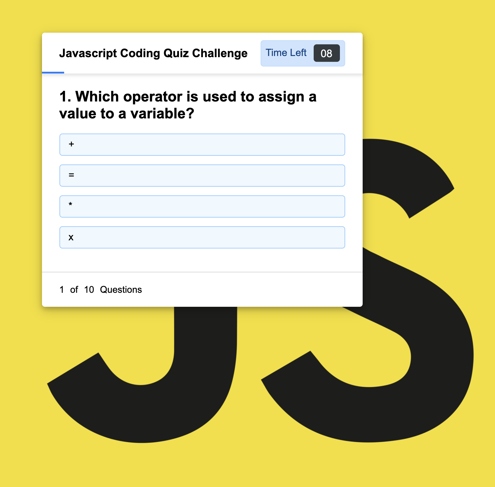
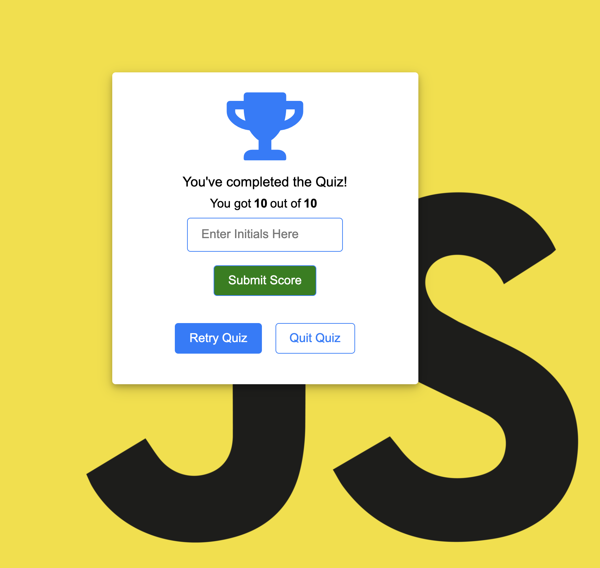

<h1 align="center" color="yellow"><a href="https://github.com/johnsonr84/code-quiz-challenge">Javascript Code Quiz ⏳</a></h1>

## Description 
  Timed JavaScript Quiz featuring questions on fundamentals. Answer 10 code related questions within 200 seconds. Each question can only be answered once and a wrong answer will subtract 10 seconds off the countdown timer. To save score simply enter initials at the end of the quiz. 

  
  
  
  

## Built With

  ## Table of Contents 
  * [Description](#Description)
  * [Project URL](#Project-URL)
  * [Deployment](#Deployment)
  * [[Demo/Screenshots](#Demo/Screenshots)
  * [Usage](#Usage)
  * [Credits](#Credits)
  * [License](#License)
  * [Resources](#Resources)
  * [Contact](#Contact)
  * [Author](#Author)
  #

## Project URL
  https://github.com/johnsonr84/code-quiz-challenge

## Deployment
  https://johnsonr84.github.io/code-quiz-challenge/

## Demo/Screenshots
  <table>
  <tr>
    <td>code-quiz start</td>
     <td>code-quiz instructions</td>
  </tr>
  <tr>
    <td></td>
    <td></td>
  </tr>
  </table>
  <table>
  <tr>
     <td>code-quiz question</td>
     <td>code-quiz scores</td>
  </tr>
   <tr>
    <td></td>
    <td></td>
  </tr>
 </table>

  ## Installation 
  No installations required at this time 

  ## Usage 
  No usage requirements

  ## Credits 
  Me, myself and Irene 

  ## License 
  This project is [mit](https://choosealicense.com/licenses/mit/) licensed.

  ## Resources
  * [Choose a License](https://choosealicense.com/)
  * [Badmath](https://img.shields.io/github/languages/top/nielsenjared/badmath)
  * [shields.io](https://shields.io/)
  * [w3schools](https://www.w3schools.com/)
  * [stackoverflow.com](https://stackoverflow.com/)
  * [YouTube](https://www.youtube.com/)
  * [UOFU-SAN-FSF-PT-11-2020-U-C/03-Javascript/Activities]

  ## Contact
  Email: robertcjohnson1984@gmail.com 

  ## Author
  Author(s): Rob Johnson  

  GitHub: https://github.com/johnsonr84/ 
